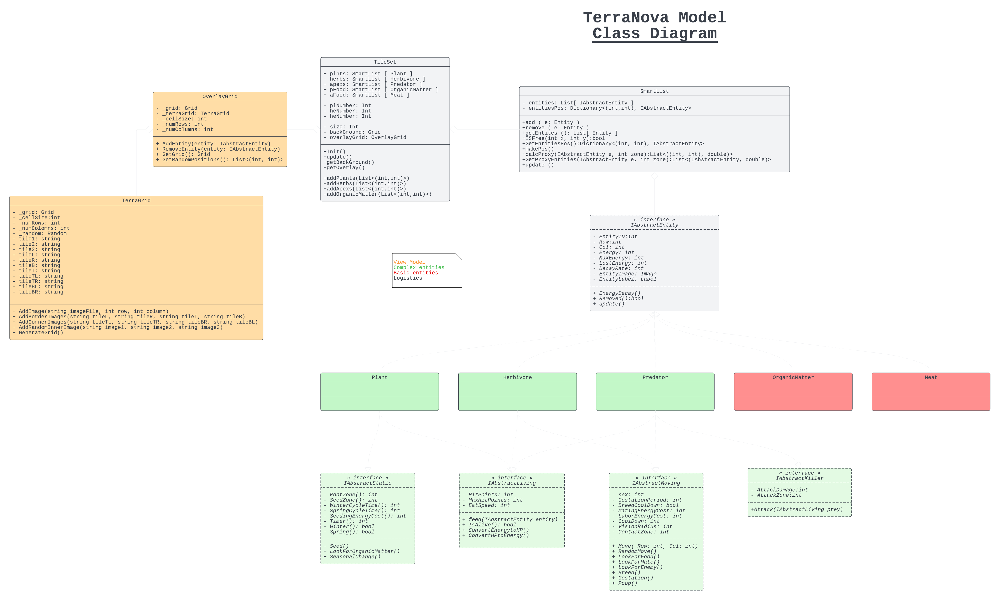
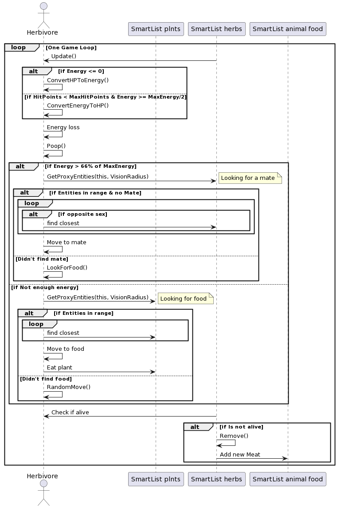

# Rapport projet écosystème 2023

## Diagramme de classe

<picture>
 
</picture>

## Diagramme de séquence

<picture>
 
</picture>

## Principes SOLID:

### Ségrégation des interfaces:

Les modèles de notre code qui gèrent les entitées présentes dans l'écosystème hérites tous de une ou plusieurs interfaces et utilisent tous les paramètres et méthodes des interfaces dont ils héritent.

Par exemple: On veut un herbivore qui est une entité vivante capable de bouger, manger, se reproduire.
La classe Herbivore.cs hérite donc de IAbstractEntity, IAbstractLiving, IAbstractMoving mais n'héritera pas de IAbstractStatic qui contient des méthodes et de attributs plus spécifique aux plantes. Tous les paramètres et les méthodes de ces interfaces sont utiles à la classe.

### Principe de Liskov

Toute nos méthodes ont été codées avec les interfaces en paramètre mais on peut très bien passer une classe qui hérite d'une de ces interfaces.

Par exemple: La méthode Feed(IAbstractEntity entity) de IAbstractLiving prend en paramètre une IAbstractEntity, mais si on lui met une instance de Plant.cs en entrée, tout  fonctionnera perfaitement.

